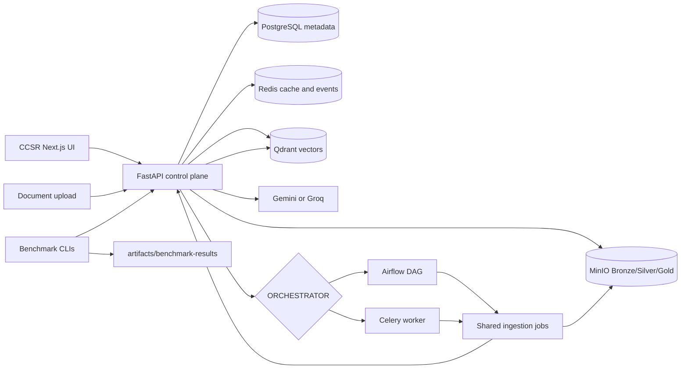
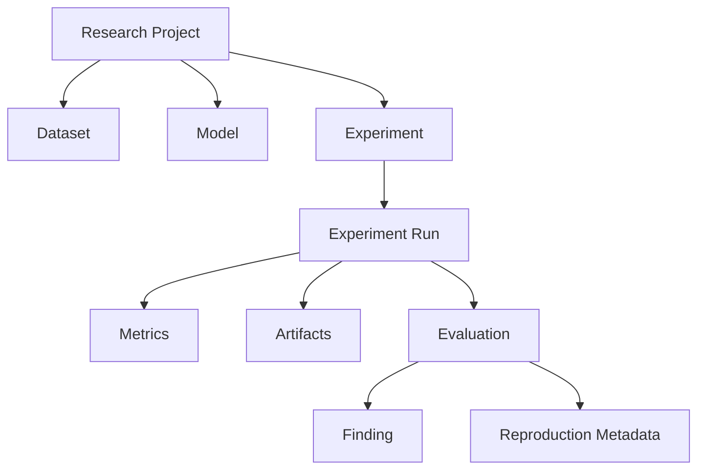

# CCSR

> **Canonical Computer Science Research**

**Research. Experiment. Evaluate. Reproduce.**

[](https://github.com/moad-cod/RAGForge/actions/workflows/frontend.yml)
[](https://github.com/moad-cod/RAGForge/actions/workflows/control-plane-e2e.yml)

CCSR is an open-source, local-first research engineering system for computer science and AI experimentation. It provides a reproducible environment for defining research questions, running experiments, tracking configurations and artifacts, evaluating results, comparing runs, and preserving findings.

The project evolved from RAGForge. Its current implementation is strongest in Retrieval-Augmented Generation, with durable document ingestion, hybrid retrieval, tracing, benchmarking, and evaluation infrastructure. CCSR generalizes these foundations into a broader research system for NLP, Computer Vision, multimodal AI, machine learning, and related mathematical work.

> CCSR is being built around one principle: research results are more useful when the experiment, configuration, evidence, metrics, artifacts, and environment that produced them can be inspected and reproduced.

**Quick links:** [Repository Context](CONTEXT.md) | [System Map](docs/map/CONTEXT.md) | [Docker Quick Start](#docker-quick-start) | [Architecture](#architecture) | [RAG Research Domain](#rag-research-domain) | [Evaluation](#evaluation-and-experiments) | [Reproducibility](#reproducibility) | [Project Map](PROJECT_MAP.md) | [Backend Map](backend/BACKEND_MAP.md) | [Frontend Map](frontend/FRONTEND_MAP.md)

## What Is CCSR?

CCSR, Canonical Computer Science Research, is a local-first research control plane for computer-science and AI experiments. The long-term platform is intended to connect research questions, research projects, experiments, experiment runs, datasets, models, configurations, metrics, artifacts, papers, research notes, mathematical concepts, findings, and reproducibility metadata.

Those broader research objects are the product direction, not a claim that all of them are implemented today. The current system is strongest in Retrieval/RAG: it can ingest documents, create versioned artifacts, index dense and sparse vectors, run grounded queries, stream answers, persist retrieval traces, and benchmark Airflow and Celery ingestion paths.

## From RAGForge To CCSR

RAGForge began as a platform for engineering and evaluating complete Retrieval-Augmented Generation systems. As the research scope expanded beyond retrieval into NLP experiments, model evaluation, fine-tuning, Computer Vision, multimodal AI, benchmarking, and mathematical foundations, the project evolved into CCSR.

The existing RAG system is not being discarded. It becomes the first mature research domain inside CCSR and provides the implementation foundation for future experiment, evaluation, comparison, and reproducibility workflows.

## Research Philosophy

```text
Research
  -> Experiment
  -> Evaluate
  -> Compare
  -> Finding
  -> Reproduce
```

CCSR is intended to preserve both results and context: the dataset or source corpus, model and provider choices, retrieval or processing configuration, orchestration path, metrics, traces, generated artifacts, environment, and code state required to understand a result.

Today, this philosophy is partially realized through the RAG control plane: document versions, ingestion runs, Bronze/Silver/Gold artifacts, query logs, retrieval logs, benchmark configurations, and generated benchmark reports. Future CCSR milestones will generalize that pattern into first-class experiment records and reproducibility manifests.

## Current Capabilities

This section describes the current implementation, not the full CCSR roadmap.

- User registration, login, profile update, JWT-protected backend routes, and HttpOnly-cookie frontend sessions.
- Owner-scoped project CRUD with per-project Qdrant collections.
- Document listing, detail views, version history, soft deletion, and same-filename re-upload for new versions.
- Durable file ingestion for PDF, DOCX, XLSX, PPTX, CSV, HTML/HTM, Markdown, and plain text.
- MinIO Bronze/Silver/Gold artifact paths for durable file ingestion.
- Configurable chunking through a backend registry: fixed-size, paragraph, sentence, semantic, hierarchical, late-chunking, and proposition strategies.
- Dense FastEmbed vectors, sparse BM25 vectors, and hybrid Qdrant retrieval with project/document payload filters.
- Gemini and Groq generation through OpenAI-compatible chat-completion clients.
- Streaming query responses over SSE with stage and token events.
- Query history, persisted answers, retrieval traces, ranked evidence records, and source inspection.
- Redis-backed best-effort query cache and ingestion event replay, with PostgreSQL as the authoritative state store.
- Airflow and Celery ingestion orchestration profiles that share the same durable ingestion stage boundaries.
- Airflow-versus-Celery benchmark CLIs that write JSON and Markdown artifacts.
- Next.js control-plane UI for projects, sources, ingestion status, playground chat, query history, observability, organization management, and settings.
- Docker Compose runtime for the frontend, FastAPI, PostgreSQL, Qdrant, MinIO, Redis, and optional Airflow/Celery profiles.

## Research Domains

These domains describe the CCSR direction. Only the Retrieval/RAG domain is currently mature.

### Retrieval And RAG

Current strongest domain. The repository implements document ingestion, chunking, embedding, hybrid retrieval, grounded generation, source tracing, query history, ingestion observability, and Airflow/Celery orchestration benchmarks.

### Natural Language Processing

Planned generalized experimentation domain. Current NLP-related behavior exists through text parsing, chunking, embeddings, retrieval, and hosted generation, but there is not yet a generic NLP experiment engine.

### Computer Vision

Planned experimentation domain. The repository does not currently implement general Computer Vision experiment tracking, datasets, models, metrics, or artifact workflows.

### Multimodal AI

Experimental in the current codebase for PDF page ingestion/query using optional ColQwen2-style multimodal embeddings, Cloudflare R2 image storage, a separate Qdrant collection, and Gemini vision responses. The default runtime does not include the heavy multimodal dependencies.

### ML And AI Systems

Planned broader domain for model, fine-tuning, systems, and benchmarking experiments. Current system-level measurement exists mainly through ingestion orchestration benchmarks and operational RAG observability.

### Mathematics

Planned knowledge-linking domain for mathematical concepts and foundations related to ML/AI research. There is no implemented mathematical knowledge graph or note-linking model yet.

## Project Status

CCSR is an active engineering project. The default runtime remains text-RAG focused while the broader research-platform model is being introduced carefully.

| Capability | Status | Notes |
| --- | --- | --- |
| Auth, projects, documents, query history | Implemented | JWT auth, ownership-scoped projects, soft deletes, durable query logs. |
| Next.js control-plane UI | Implemented | Auth, projects, source management, ingestion progress, playground chat, history, observability, organization, and profile views. |
| Durable file ingestion | Implemented | File upload lands raw data in MinIO Bronze, then writes Silver/Gold artifacts and Qdrant indexes when orchestration runs. |
| Airflow ingestion orchestration | Implemented | Docker profile and DAG trigger the shared pipeline jobs. |
| Celery ingestion orchestration | Implemented | Docker profile and worker tasks run the same shared pipeline stages. Celery has focused tests and benchmark validation; the full infrastructure E2E path is still Airflow-oriented. |
| Dense, sparse, and hybrid retrieval | Implemented | FastEmbed dense vectors plus BM25 sparse vectors in Qdrant. |
| Streaming answers | Implemented | SSE query stream emits stages and generated tokens. |
| Source tracing | Implemented | Query logs store ranked retrieval records linked back to chunks and document versions when lineage exists. |
| Redis query cache and ingestion events | Implemented | Best-effort cache and event replay; PostgreSQL remains authoritative. |
| Airflow-versus-Celery benchmarking | Implemented | Benchmark CLIs drive real ingestion endpoints and write JSON/Markdown reports. |
| Cross-encoder reranking | Experimental | Code path exists, but heavy reranker dependencies are not in the default backend requirements. |
| Multimodal PDF ingestion/query | Experimental | Uses R2 image storage and a separate multimodal collection when configured; heavy dependencies are optional. |
| BEIR/SciFact retrieval evaluation | In Progress | A SciFact config and legacy metrics exist; no verified BEIR runner command is currently documented. |
| First-class experiment records | Planned | Required before generic CCSR experiment lists, run details, and comparison workflows can be truthful. |
| Dataset registry and versioning | Planned | Needed for cross-domain experiment provenance and compatibility checks. |
| Model registry and versioning | Planned | Needed for reproducible model and provider comparisons. |
| Research findings and notes | Planned | Intended to connect evaluated evidence to research conclusions. |
| Paper and mathematical concept relationships | Planned | Directional knowledge layer; no implemented graph API exists yet. |
| Reproducibility manifests | Planned | Target manifest fields are documented below, but no complete manifest model is implemented. |
| Organization membership and roles | Partially implemented | Membership records and owner/admin organization mutations are enforced. Platform-wide visitor/member/admin roles, invitations, membership management, and project collaboration are not implemented. |
| Local generation through Ollama | Planned | Hosted Gemini/Groq generation is implemented; Ollama is not wired into the current config. |
| Cross-domain NLP/CV/ML experiment support | Planned | The current mature implementation remains Retrieval/RAG. |

## Architecture

This is the real current architecture.



**Control plane:** FastAPI owns authentication, project/document APIs, ingestion-run state, query history, retrieval logs, and internal pipeline callbacks.

**Ingestion/data plane:** Durable file uploads land in MinIO Bronze. Airflow or Celery then runs shared Bronze-to-Silver, Silver-to-Gold, Qdrant upsert, and finalize stages. PostgreSQL remains the authoritative state machine.

**Retrieval and generation path:** Interactive RAG queries enter through FastAPI, embed the question, retrieve from Qdrant with project/document filters, build a grounded prompt, call Gemini or Groq, stream answer tokens, and store trace records.

**Evaluation path:** Benchmark CLIs drive public API workflows and write generated reports to `artifacts/benchmark-results/`.

### CCSR Research Architecture - Direction

The following diagram is a target architecture for the broader research platform. It is not fully implemented today.



## RAG Research Domain

The current RAG domain is the implementation foundation for CCSR. It demonstrates how a research system can preserve inputs, transformations, traces, and evaluation artifacts rather than only returning a final answer.

### Document Ingestion Lifecycle

The complete durable path is `POST /ingest/file`.

```text
Upload
  -> validate ownership, file type, size, and chunker
  -> write raw bytes to MinIO Bronze
  -> create DocumentVersion and IngestionRun in PostgreSQL
  -> enqueue Airflow DAG or Celery chain when configured
  -> parse and chunk into Silver Parquet
  -> embed into Gold Parquet
  -> upsert deterministic points into Qdrant
  -> update chunk lineage, version status, and ingestion status
  -> stream progress over SSE
```

URL, Google Drive, and multimodal ingestion are also present, but they do not currently provide the same full Bronze/Silver/Gold lineage as durable file ingestion. URL and Google Drive ingestion are synchronous. Multimodal ingestion is synchronous and requires optional heavy dependencies plus R2-compatible image storage.

### Query And Retrieval Lifecycle

```text
Question
  -> authenticate user
  -> verify project ownership and optional document scope
  -> normalize/cache lookup
  -> embed query
  -> hybrid Qdrant retrieval with payload filtering
  -> optional reranking when dependencies are available
  -> prompt construction from retrieved context
  -> Gemini or Groq generation
  -> SSE token streaming
  -> query log and retrieval trace persistence
```

Retrieval traces include rank, Qdrant score, optional rerank score, retrieval strategy, chunk ID, document ID, document version ID, chunk text, and whether the evidence was used in the answer. Fully linked traces are available when retrieved points have PostgreSQL `Chunk` lineage.

## Technology Stack

| Layer | Technology | Responsibility |
| --- | --- | --- |
| Frontend | Next.js App Router, React, TypeScript | Auth pages, project workspace, source management, playground chat, history, observability. |
| Frontend data | TanStack Query, typed API helpers, SSE parser | Same-origin authenticated proxy, caching, streaming handling. |
| API/control plane | FastAPI, Pydantic, SQLAlchemy async | HTTP routes, auth, orchestration boundary, query execution. |
| Metadata database | PostgreSQL, Alembic | Users, projects, documents, versions, ingestion runs, chunks, query logs. |
| Vector database | Qdrant | Dense and sparse vectors with project/document payload filters. |
| Object storage | MinIO | Bronze raw files, Silver chunk artifacts, Gold embedded artifacts. |
| Cache/events | Redis | Best-effort query cache and replayable ingestion events. |
| Orchestration | Airflow 3.3 or Celery 5.6 | Durable file-ingestion execution. |
| Embeddings | FastEmbed, `BAAI/bge-small-en-v1.5`, BM25 sparse embeddings | Text embedding and sparse retrieval features. |
| LLM providers | Gemini, Groq | Hosted answer generation through OpenAI-compatible chat APIs. |
| Containers | Docker Compose | Local core stack plus optional Airflow and Celery profiles. |
| Testing | unittest, Vitest, Playwright, Compose config validation | Backend, frontend, integration, e2e, and benchmark checks. |

## Docker Quick Start

Requirements: Docker, Docker Compose, and a copy of `.env.example`.

```bash
cp .env.example .env
docker compose --profile celery up -d --build
docker compose exec fastapi alembic upgrade head
```

Open:

- Frontend: `http://localhost:3000`
- FastAPI docs: `http://localhost:8000/docs`
- Qdrant: `http://localhost:6333/dashboard`
- MinIO console: `http://localhost:9001`

The recommended local stack starts the frontend, FastAPI, PostgreSQL, Qdrant,
MinIO, Redis, MinIO bucket initialization, and one memory-isolated Celery
ingestion worker. Set `GEMINI_API_KEY` or `GROQ_API_KEY` in `.env` before asking
hosted-model questions.

### Airflow Profile

Use this when you want uploads to trigger the Airflow ingestion DAG.

```bash
python -c "import secrets; print(secrets.token_urlsafe(32))"
```

Set the generated value as `PIPELINE_SERVICE_TOKEN` in `.env`, then configure:

```dotenv
ORCHESTRATOR=airflow
AIRFLOW_API_URL=http://airflow-apiserver:8080
AIRFLOW_USERNAME=admin
AIRFLOW_API_JWT_SECRET=replace-with-a-random-airflow-jwt-secret
PIPELINE_SERVICE_TOKEN=replace-with-a-random-internal-token
```

Also set `AIRFLOW_PASSWORD` to the local Airflow admin password you want to use.

Start the profile:

```bash
docker compose --profile airflow up -d --build
docker compose exec fastapi alembic upgrade head
```

Open Airflow at `http://localhost:8080`.

### Celery Profile

This is the recommended local ingestion mode. It keeps model loading outside
the API and Airflow scheduler, runs one ingestion task at a time, and gives the
embedding worker a dedicated 3 GiB memory limit.

```dotenv
ORCHESTRATOR=celery
PIPELINE_SERVICE_TOKEN=replace-with-the-same-token-for-api-and-worker
```

Start the profile:

```bash
docker compose --profile celery up -d --build
docker compose exec fastapi alembic upgrade head
```

The worker entry point is:

```bash
celery -A app.workers.celery_app:celery_app worker --loglevel=INFO --concurrency=1
```

## Local Development

### Backend

```bash
cd backend
python -m venv .venv
source .venv/bin/activate
pip install -r requirements.txt
alembic upgrade head
uvicorn app.main:app --reload
```

Development utilities:

```bash
python -m scripts.seed_control_plane --namespace development
python -m scripts.validate_control_plane
python -m scripts.reset_dev_db
# Non-interactive automation:
python -m scripts.reset_dev_db --yes
# Reset PostgreSQL when Qdrant is intentionally unavailable:
python -m scripts.reset_dev_db --yes --skip-qdrant
```

`reset_dev_db` is destructive and intended only for local development. It asks
for an explicit `RESET` confirmation unless `--yes` is provided.

### Frontend

```bash
cd frontend
npm install
npm run dev
```

The frontend talks to FastAPI through `frontend/src/app/api/backend/[...path]/route.ts`. Authentication uses an HttpOnly session cookie; JWTs are not exposed to browser JavaScript.

## Configuration

Use `.env.example` as the source of truth. Important variables:

| Group | Variable | Required | Purpose |
| --- | --- | --- | --- |
| App | `SECRET_KEY` | Yes | JWT signing secret. Generate a random value for every environment. |
| App | `FRONTEND_PORT` | No | Frontend port for Docker Compose. |
| Auth | `AUTH_COOKIE_SECURE` | Production | Set to `true` behind HTTPS. |
| PostgreSQL | `DATABASE_URL` | Yes | Main async SQLAlchemy database URL. |
| PostgreSQL tests | `TEST_DATABASE_URL`, `RUN_DATABASE_TESTS` | Optional | Enables isolated DB integration tests. |
| Qdrant | `QDRANT_URL`, `QDRANT_API_KEY` | Yes/optional | Vector database endpoint and optional API key. |
| Redis | `REDIS_URL` | Optional | Query cache and ingestion event replay. |
| Redis | `QUERY_CACHE_TTL_SECONDS`, `EVENT_STREAM_*`, `SSE_*` | Optional | Cache TTL and SSE replay/heartbeat behavior. |
| MinIO | `MINIO_ENDPOINT`, `MINIO_ACCESS_KEY`, `MINIO_SECRET_KEY` | Yes for durable file ingestion | S3-compatible artifact storage. Rotate development defaults outside local use. |
| MinIO | `MINIO_BUCKET_BRONZE`, `MINIO_BUCKET_SILVER`, `MINIO_BUCKET_GOLD` | Yes | Data-lake bucket names. |
| LLM | `GEMINI_API_KEY`, `GROQ_API_KEY` | Required per provider | Hosted generation credentials. |
| LLM | `GEMINI_BASE_URL`, `GROQ_BASE_URL`, `LLM_*` | Optional | Provider base URLs, retries, and timeout. |
| Embeddings | `EMBEDDING_BACKEND` | Optional | `fastembed` for runtime, `deterministic` for offline tests. |
| Embeddings | `EMBEDDING_BATCH_SIZE`, `EMBEDDING_MAX_BATCH_SIZE` | Optional | Requested default batch size and the hard post-planner safety cap. |
| Orchestration | `ORCHESTRATOR` | Optional | `airflow`, `celery`, or disabled by using another value. |
| Airflow | `AIRFLOW_API_URL`, `AIRFLOW_USERNAME`, `AIRFLOW_PASSWORD`, `AIRFLOW_INGESTION_DAG_ID` | Required for Airflow trigger | FastAPI-to-Airflow REST trigger settings. |
| Celery | `CELERY_BROKER_URL`, `CELERY_RESULT_BACKEND`, `CELERY_TASK_*` | Required for Celery trigger | Worker broker, results, retry, eager, and prefetch settings. |
| Pipeline | `PIPELINE_SERVICE_TOKEN` | Required for orchestrated ingestion | Internal bearer token for Airflow/Celery callbacks. |
| Multimodal | `R2_ACCOUNT_ID`, `R2_ACCESS_KEY_ID`, `R2_SECRET_ACCESS_KEY`, `R2_BUCKET_NAME`, `R2_PUBLIC_URL` | Optional | Required only for `/ingest/multimodal`. |

Some internal environment variables still use the historical `RAGFORGE_` prefix, such as pipeline command templates. They are intentionally not renamed by this README update because they are runtime identifiers.

## Usage Example

1. Start the Docker stack and run migrations.
2. Register or sign in at `http://localhost:3000`.
3. Create a project.
4. Upload a supported document and select a chunker.
5. Watch the ingestion run progress from upload through indexing.
6. Ask a question in the project playground.
7. Open citations or the retrieval trace to inspect the supporting chunks and scores.

Minimal health check:

```bash
curl http://localhost:8000/health
```

The full authenticated API is easier to explore through `http://localhost:8000/docs`.

## API Overview

Protected user endpoints require `Authorization: Bearer <JWT>`. The frontend stores that token server-side in an HttpOnly cookie and proxies requests through same-origin routes.

The current API primarily exposes the RAG/control-plane functionality inherited from RAGForge. First-class CCSR research APIs for generic experiments, datasets, models, findings, and reproducibility manifests are part of the roadmap.

| Area | Routes |
| --- | --- |
| Health | `GET /health` |
| Auth | `POST /auth/register`, `POST /auth/login`, `GET/PATCH/DELETE /auth/me` |
| Organizations | `POST/GET /organizations/`, `GET/PATCH/DELETE /organizations/{organization_id}` |
| Projects | `POST/GET /projects/`, `GET/PATCH/DELETE /projects/{project_id}` |
| Documents | `GET /documents/?project_id=...`, `GET /documents/{document_id}`, `GET /documents/{document_id}/versions`, `DELETE /documents/{document_id}` |
| Chunkers | `GET /chunkers` |
| Ingestion | `POST /ingest/file`, `POST /ingest/url`, `POST /ingest/gdrive`, `POST /ingest/multimodal` |
| Ingestion runs | `GET /ingest/runs`, `GET /ingest/runs/{id}`, `POST /ingest/runs/{id}/retry`, `GET /ingest/runs/{id}/events` |
| RAG | `POST /rag/query`, `POST /rag/query/stream`, `POST /rag/multimodal-query` |
| Observability | `GET /rag/projects/{project_id}/history`, `GET /rag/queries/{query_log_id}` |
| Internal pipeline | `/internal/pipeline/*` routes protected by `PIPELINE_SERVICE_TOKEN` |

## Evaluation And Experiments

CCSR separates tests, benchmarks, and research evaluation:

```text
backend/tests/
  verifies implementation correctness

backend/evaluation/
  contains benchmark runners, configs, metrics, and legacy evaluation scripts

artifacts/benchmark-results/
  stores generated benchmark reports
```

Software tests verify correctness. Benchmarks measure system behavior such as orchestration latency, throughput, failure handling, and recovery. Retrieval evaluation measures retrieval quality. Future CCSR experiments will generalize this abstraction across research domains, but a generic experiment engine is not implemented yet.

### Airflow Versus Celery Benchmark

These CLIs drive the real FastAPI ingestion endpoint, wait for ingestion runs to finish, validate API-visible gates, and write JSON plus Markdown reports.

Airflow:

```bash
PYTHONPATH=backend backend/.venv/bin/python -m evaluation.airflow_benchmark.cli \
  --api-url http://localhost:8000 \
  --documents 10 \
  --concurrency 2 \
  --chunker paragraph
```

Celery:

```bash
PYTHONPATH=backend backend/.venv/bin/python -m evaluation.celery_benchmark.cli \
  --api-url http://localhost:8000 \
  --documents 10 \
  --concurrency 2 \
  --chunker paragraph
```

Reports are written to:

```text
artifacts/benchmark-results/airflow/
artifacts/benchmark-results/celery/
```

The benchmark config at [`backend/evaluation/configs/airflow_vs_celery.yaml`](backend/evaluation/configs/airflow_vs_celery.yaml) tracks ingestion metrics such as end-to-end latency, queue waiting time, processing time, throughput, success rate, recovery time, retry overhead, duplicate processing rate, and scaling efficiency.

### Retrieval Evaluation

[`backend/evaluation/configs/scifact.yaml`](backend/evaluation/configs/scifact.yaml) declares a BEIR/SciFact retrieval-evaluation target with Recall, Precision, MRR, and NDCG metrics. The repository does not currently include a verified BEIR runner command, so this is documented as in progress rather than a completed experiment workflow.

Airflow/Celery benchmarks measure orchestration behavior. BEIR-style evaluation measures retrieval quality. Answer-generation evaluation is a separate concern.

## Reproducibility

Reproducibility is a central CCSR principle, but complete research manifests are not implemented yet.

### Supported Today

The current system partially supports reproducibility through:

- Explicit document versions with content hashes and artifact paths.
- Durable ingestion runs with statuses, timestamps, errors, and orchestration identifiers.
- Bronze/Silver/Gold artifacts for durable file ingestion.
- Deterministic chunk and Qdrant point identifiers for batch-indexed document versions.
- Stored query logs, answers, provider/model metadata, latency, cache state, and retrieval traces.
- Airflow/Celery benchmark configuration files and generated benchmark artifacts.
- Docker Compose environments and documented local commands.

### Target Manifest

A future CCSR reproducibility manifest should capture:

- Experiment ID.
- Git commit.
- Dataset version or content hash.
- Model/provider version.
- Full configuration snapshot.
- Random seed where applicable.
- Runtime environment and dependencies.
- Hardware or worker profile.
- Metrics and evaluation protocol.
- Artifacts, logs, traces, and failure records.

This complete manifest is a roadmap item, not a current persisted entity.

## Testing

### Backend

Run from `backend/` after installing `requirements.txt`:

```bash
PYTHONPATH=. .venv/bin/python -m unittest discover -s tests/unit -v
PYTHONPATH=. .venv/bin/python -m unittest discover -s tests/integration -v
PYTHONPATH=. .venv/bin/python -m unittest discover -s tests/benchmarks -v
```

Database-backed integration tests require an isolated test database:

```bash
RUN_DATABASE_TESTS=1 PYTHONPATH=. .venv/bin/python -m unittest discover -s tests/integration/postgres -v
```

End-to-end control-plane test:

```bash
make e2e-v2
```

### Frontend

Run from `frontend/`:

```bash
npm run lint
npm run test
npm run typecheck
npm run build
npm run test:e2e
```

### Compose Validation

Run from the repository root:

```bash
docker compose config
docker compose --profile airflow config
docker compose --profile celery config
docker compose -f docker-compose.yml -f docker-compose.e2e.yml --profile airflow config
```

## Security And Tenant Isolation

Current enforced boundaries:

- JWT authentication for protected user routes.
- Password hashing with bcrypt.
- Project and document access checks based on the authenticated user's owned projects.
- Query authorization before retrieval and generation.
- Qdrant payload filters for project and optional document scope.
- Project-specific Qdrant collection names.
- Tenant-aware MinIO artifact paths containing organization, project, document, and version identifiers.
- Separate internal pipeline bearer token for Airflow/Celery callbacks.
- HttpOnly cookie handling in the frontend proxy.

Current limitation: organization CRUD and `organization_id` fields exist, but organization membership and role authorization are not fully enforced. The accurate description today is tenant-aware user and project isolation, not full organization-based multi-tenancy.

## Project Structure

```text
.
|-- backend/
|   |-- app/
|   |   |-- api/                 # FastAPI routers
|   |   |-- core/                # settings, auth, database
|   |   |-- models/              # SQLAlchemy control-plane models
|   |   |-- repositories/        # PostgreSQL data access
|   |   |-- services/            # parsing, chunking, storage, retrieval, orchestration
|   |   `-- workers/             # Celery app and ingestion tasks
|   |-- airflow/                 # Airflow image, DAGs, plugins
|   |-- alembic/                 # database migrations
|   |-- evaluation/              # benchmark CLIs, configs, metrics, legacy scripts
|   |-- jobs/                    # shared ingestion pipeline stages
|   |-- scripts/                 # development and validation CLIs
|   `-- tests/                   # unit, integration, e2e, benchmark tests
|-- frontend/
|   `-- src/                     # Next.js app, components, hooks, lib, tests
|-- docs/                        # architecture, research, reports, plans
|-- artifacts/                   # generated benchmark/test outputs
|-- scripts/                     # repository-level helper scripts
|-- docker-compose.yml
|-- docker-compose.e2e.yml
|-- Makefile
|-- PROJECT_MAP.md
`-- README.md
```

## Roadmap

### Phase 1 - Foundation

- Complete and document the BEIR/SciFact retrieval-quality runner.
- Harden the existing RAG evaluation artifact format.
- Add local model runtime support, such as Ollama, behind explicit configuration.
- Enforce organization membership and role-based authorization.
- Package optional multimodal and reranker dependencies into separate profiles or images.
- Harden production deployment docs for TLS, secrets, backups, and object-store credentials.
- Add current UI screenshots or a short demo video.

### Phase 2 - Experiment Core

- Add first-class Experiment and ExperimentRun records.
- Define reusable metric definitions and evaluation protocols.
- Preserve artifact lineage for experiment runs.
- Add experiment comparison views backed by real metrics.
- Add reproducibility manifest generation.

### Phase 3 - Research Registry

- Add dataset registry and versioning.
- Add model registry and versioning.
- Add research project records beyond the current RAG project model.
- Add findings, research notes, and paper relationships.
- Link research objects to experiment evidence.

### Phase 4 - Multi-Domain Research

- Add NLP experiment templates.
- Add Computer Vision experiment artifacts and evaluation views.
- Expand multimodal experiment workflows beyond the current optional PDF path.
- Add general ML benchmark support.
- Add domain-specific metric visualizations when backed by real data.

### Phase 5 - Research Knowledge Layer

- Add a research graph connecting papers, concepts, datasets, experiments, metrics, and findings.
- Add mathematical concept linking.
- Add paper-to-experiment and finding-to-evidence relationships.
- Add reproducible public benchmark reports when supported by real artifacts.

## Contributing

1. Read [`PROJECT_MAP.md`](PROJECT_MAP.md), [`backend/BACKEND_MAP.md`](backend/BACKEND_MAP.md), and [`frontend/FRONTEND_MAP.md`](frontend/FRONTEND_MAP.md) before making broad changes.
2. Keep API, frontend, pipeline, and evaluation behavior aligned with the existing maps.
3. Clearly distinguish implemented behavior from planned research-platform capabilities.
4. Prefer focused tests for the code path you change.
5. Do not commit generated benchmark outputs unless they are intentionally being preserved as reference artifacts.

## License

Copyright 2026 Mouad El Baz.

CCSR is licensed under the [Apache License 2.0](LICENSE).

You may use, modify, and distribute this project in accordance with the terms of the Apache License 2.0. See the [LICENSE](LICENSE) file for the complete license text and the [NOTICE](NOTICE) file for project attribution information.

### Third-Party Components

CCSR uses and integrates with third-party open-source software, models, APIs, and infrastructure services. Each third-party component remains subject to its own license and terms of use.

This includes, among others:

- FastAPI
- Next.js
- PostgreSQL
- Qdrant
- MinIO
- Redis
- Apache Airflow
- Celery
- SQLAlchemy
- FastEmbed
- PyArrow
- Groq and Gemini-compatible API integrations
- Optional ColQwen2 and sentence-transformers components

The Apache License 2.0 for CCSR does not replace or override the licenses, usage restrictions, model licenses, API terms, or data licenses of these third-party components.

### Data And Model Licensing

CCSR source code is licensed under Apache License 2.0. Datasets, documents uploaded by users, pretrained models, model weights, embedding models, and generated artifacts are not automatically covered by the CCSR software license.

Users are responsible for ensuring that they have the necessary rights and permissions to process, store, embed, distribute, or publish any data or model used with CCSR.

### Disclaimer

CCSR is provided on an "AS IS" basis, without warranties or conditions of any kind, as described in the Apache License 2.0.
